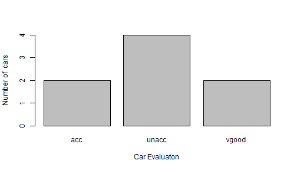

## Project Introduction

This application takes desired attributes of the car, as user inputs and based on those inputs gives the  the number of cars and their acceptability in a bar plot. 

#### Input: 
Desired attributes of the car e.g. number of doors, safety Rating, maintenance cost etc.   

### Processing:
Selects the Acceptaility rating of cars and number of cars with that acceptability.   

#### Result:
Bar plot of number of cars(Y axis) with acceptability (X axis).     Acceptability values can be:  
unacc- Unacceptable   
acc - Acceptable  
good - Good  
vgood - Very Good  

**Data source for the project**: http://archive.ics.uci.edu/ml/machine-learning-databases/car/  


--- .class #id 

## R code 
Read data, filter data on attribute selections(e.g. below), get car evaluation results

```r
library(dplyr)
d1<-read.table("http://archive.ics.uci.edu/ml/machine-learning-databases/car/car.data", 
sep=",", header=FALSE)
colnames(d1)<-c("buyingprice","maintcost","doors","persons","lugboot","safety","car")
sub<-d1 %>%
select(car,buyingprice,maintcost,doors,persons,lugboot,safety) %>%
        filter(buyingprice=='med' & maintcost=='med' &
                doors %in% c('2','3') & persons %in% c('2','4') & 
                lugboot %in% c('big','med') & safety=='high')
agg<-aggregate(sub,by=list(sub$car),FUN=length)
agg
```

```
##   Group.1 car buyingprice maintcost doors persons lugboot safety
## 1     acc   2           2         2     2       2       2      2
## 2   unacc   4           4         4     4       4       4      4
## 3   vgood   2           2         2     2       2       2      2
```

--- .class #id 
## Bar Plot
Bar plot shows number of Cars & their evaluations[see slide 2 for possible values for the car acceptability] based on the attributes[see previous slide] selected.


```r
      barplot(agg$car,
              ylab="Number of  cars",
              xlab="Car Evaluaton",
              names.arg=agg$Group.1)
```




--- .class #id 

## Shiny Application
Try the Car Evaluation shiny application!

<iframe src="https://123explorer.shinyapps.io/datapr/"></iframe>
--- .class #id 


